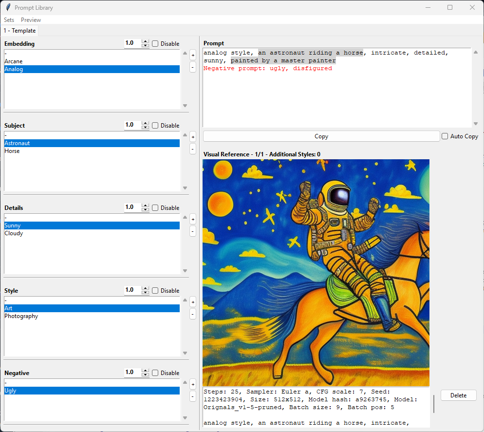
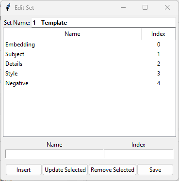
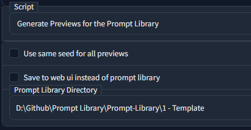

# Prompt-Library
 A simple Python UI to manage your favourite prompts for prompt based image generation

## How to use
This application allows to combine prompts from different categories (like 'Subject' , 'Details') to one prompt. It is mainly targeted to be used with https://github.com/AUTOMATIC1111/stable-diffusion-webui but I guess it can be used for any other project aswell (except for the preview generation). Different Sets can be created if for example you want to separte your SD1.5 and SD2.0 prompts. This can be done by creating subfolders or from the Interface (Sets -> New). Each subfolder needs a 'config.yaml' file which contains the categories, the prompts and their display names etc. The structure of this config file is fairly simple and can be seen in the template file. It is created automatically with 'Sets -> New' and can be further edited via the Interface. There is no need to manually edit this file anymore.
Here is a screenshot of the application:

The option 'Auto Copy' allows to copy the current prompt to the clipboard on every selection change.
The two buttons on the right of each category allows to add or delete prompts. Doubleclick on an exisiting prompt allows to edit that prompt. Changes are safed to the config.yaml automatically. If the name of a prompt is changed, all previews connected to this prompt will be moved to the '_archive' folder.

There is a Menubar with the options to add or edit a new set of prompt categories:
The first field allows you to set the name of the set. Then follows an ordered list of the categories. With the next two fields a new category can be created using the insert button. An existing category can be update with a new name or a new index with the update button. To do so, select the category you want to edit (or doubleclick to preload to edit fields) and change name and/or index. The remove button removes a category. Changes are discarded if you exit via the window close button ([x]). Save overwrites the set in editing mode or creates a new directory in new mode. If the name of a category is changed, all previews connected to this category will be moved to the '_archive' folder.

The Button "Toggle Grid View" allows to switch between Grid comparison of categories and single image view

The last category "Setting" is automatically added to every category and allows to define generation settings (Model, CFG Scale, Sampler, Steps, Seed, Size)

### Generating Previews
To create previews for your prompt combination, automatic1111's webui can be used. Copy the script in the script folder to the webui script folder. You should then see this script:

The script is based on the 'prompts_from_file.py' script.

Options:
- **Use same seed for all previews:** All previews will be generated with the same seed
- **Save to web ui instead of prompt library:** Use the prompt library to create images like you normaly would. They are stored to your webui output folder instead of the Prompt Library '_preview' folder
- **Prompt Library Directory:** Path to the folder where your config.yaml is stored

Batch size can be used to create different previews at the same time. Batch count works only if creating images for web ui in order to not clutter the Prompt Library (Batch count  repeats the whole process n times and creates images of the same prompt combination n times. Batch size creates every prompt generation only 1 time but multiple at the same time). I figured out, that stable diffusion crashes if you try to generate images with negative prompts that differ in size too much in the same batch. If you get some tensor match error, either create the different negative combination in separate batches or set batch size to 1. 

In order for this script to work, you have to generate a prompt list from the Prompt Library Menu **Preview**. Only the prompts for the current selection will be generated. If you want previews for all prompts in a category, select the first "empty" prompt ('-'). If you only want one specific prompt from a category, select it. If you don't want to create previews for this category, set the Disable checkbox.

Two options to generate prompt lists are available:
- **Create List of missing previews:** Only prompts are generated for combinations without preview yet
- **Create List of all previews:** All combination for the current selection will be generated

Keep in mind, that the combination count grows exponentially with every category and prompt. 4 categories with 2 prompts each will result in `3*3*3*3 - 1 = 80` combinations (2 prompts + 1 without this category)

All images which contain the selected prompts will then be displayed. You can navigate through them with left and right mouseclick or the mousewheel. They are sorted by how exactly they match the selection. Additional prompts from your categories which are used for the image but aren't selected, are shown in the title.

As mentioned above, renaming prompts or categories will move all associated previews to the '_archive' folder. The delete button deletes the selected image permanently

## Future plans
If time allows, I have plans to add:
- [x] Prompt Editor to create and delete prompts from the interface instead manually editing the config.yaml
- [x] Preview function to display a preview of the currently selected prompt (exponential amount of images necessary though)
- [ ] Rewrite for gradio to integrate as extension to https://github.com/AUTOMATIC1111/stable-diffusion-webui

## Installation
* Make sure Python is installed on your Computer
* Download the files
* Install the required Modules `$ pip install -r requirements.txt`
* If you want to create previews with automatic1111's webui, copy the script in the script folder to the script folder of your web ui
* Run promptLibrary.py `python promptLibrary.py`
