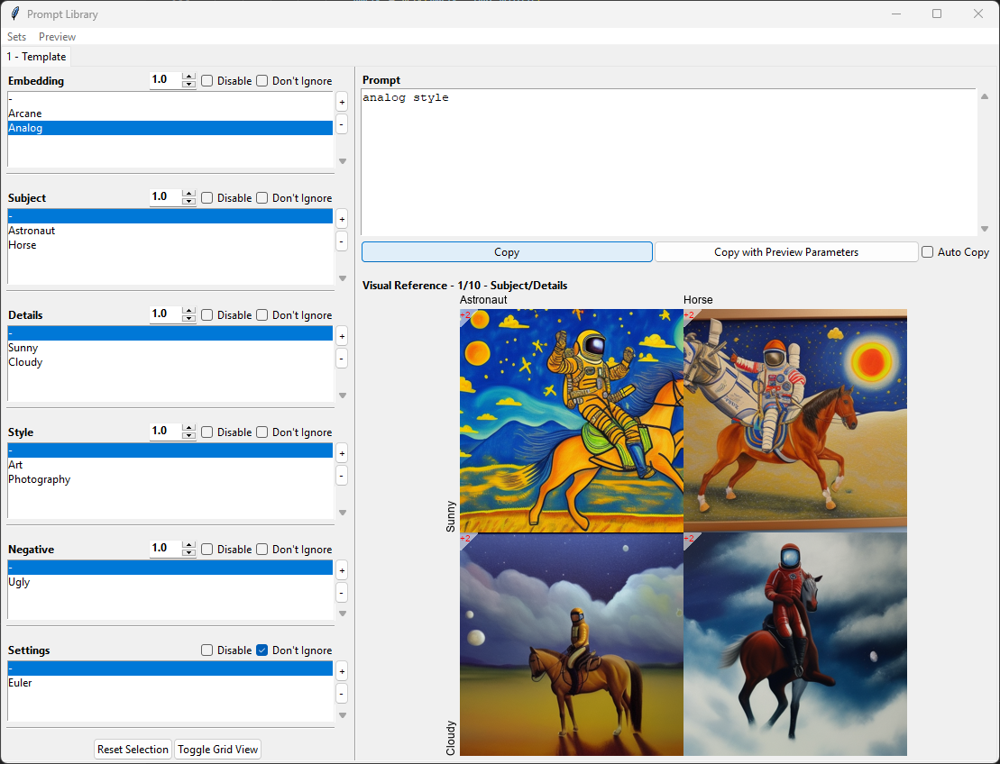

# Prompt-Library
 A simple Python UI to manage your favourite prompts for prompt based image generation

## How to use
This application allows to combine prompts from different categories (like 'Subject' , 'Details') to one prompt. It is mainly targeted to be used with https://github.com/AUTOMATIC1111/stable-diffusion-webui but I guess it can be used for any other project aswell. Different Sets can be created if for example you want to separte your SD1.5 and SD2.0 prompts. This can be done by creating subfolders or from the Interface (Sets -> New). Each subfolder needs a 'config.yaml' file which contains the categories, the prompts and their display names etc. The structure of this config file is fairly simple and can be seen in the template file. It is created automatically with 'Sets -> New' and can be further edited via the Interface. There is no need to manually edit this file anymore.
Here is a screenshot of the application:

The option 'Auto Copy' allows to copy the current prompt to the clipboard on every selection change

There is a Menubar with the options to add or edit a new set of prompt categories:
The first fiels allows you to set the name of the set. Then follows an ordered list of the categories. With the next two fields a new category can be created using the insert button. An existing category can be update with a new name or a new index with the update button. To do so, select the category you want to edit (or doubleclick to preload to edit fields) and change name and/or index. The remove button removes a category. Changes are discarded if you exit via the window close button ([x]). Save overwrites the set in editing mode or creates a new directory in new mode.

## Future plans
If time allows, I have plans to add:
- [x] Prompt Editor to create and delete prompts from the interface instead manually editing the config.yaml
- [ ] Preview function to display a preview of the currently selected prompt (exponential amount of images necessary though)
- [ ] Rewrite for gradio to integrate as extension to https://github.com/AUTOMATIC1111/stable-diffusion-webui

## Installation
* Make sure Python is installed on your Computer
* Download the files
* Install the required Modules `$ pip install -r requirements.txt`
* Run promptLibrary.py `python promptLibrary.py`
